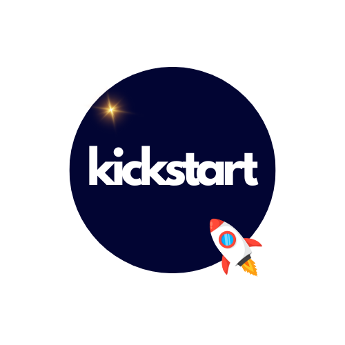

<p align="center">
    <picture>
    <source media="(prefers-color-scheme: dark)" srcset="kickstart_dark.png">
    <source media="(prefers-color-scheme: light)" srcset="./kickstart_light.png">
    
    </picture>
</p>

# Getting started

## Installing Kickstart

You can use either `make install` after cloned the project to install in your local machine or get the binary file for your system from [the latest release](https://github.com/Makepad-fr/kickstart/releases/latest). 

More installing options (`apt`, `homebrew`, `chocolatey`, `snap` etc.)  will come soon.

## How to use?

### Commands

#### `init-project`

Creates a new project `kickstart` project with the given `<project_name>`

##### Usage: 
```bash
kickstart init-project <project_name>
```

#### `add-app`

Adds a new application to the current project or a project specified with its path

##### Usage:
```bash
kickstart add-app [<project_path>] <application_name>
```

#### `add-chart`

Adds a new Helm chart to the current project or a project specified with its path

##### Usage:
```bash
kickstart add-chart [<project_path>] <application_name>
```

